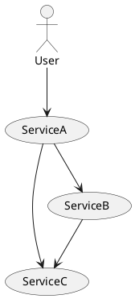
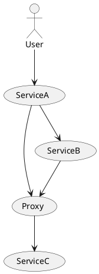

# Примеры использования Resolve + Dtab в Finagle

## Simple
Простой пример использования `Resolver`. 
В качестве результата получаем не IP+Port, а `ServiceFactory`,
то есть фактически запрос по сети не выполняется, а остается внутри. 

## Async
Пример, как можно менять набор доступных адресов. 
В частности, каждый N секунд, создаем новый `ServiceFactory`, 
который логирует время своего создания и время запроса к нему. 

## File
Уже более полезный пример, как можно использовать некоторый файл,
чтобы хранить в нем список хостов и метаданные к ним. 
Данный `Resolver` позволяет реагировать на обновление файла (проверяет каждые 5 секунд). 

## Dtab
Пример демонстрирует работу с distribution table.

Базовые правила:
```
/s## => /$/demo.Namer/simple;
/s# => /s##/prod;
/s  => /s#;
```
Локальное правило:
```
/s# => (/s##/stage1 & /s##/stage2)
```

Как видно, правила описаны для одинаковых префиксов `/s#`,
в этом случае, если более приортетное правило вернет отрицательные результать
(`NameTree.Neg`), то разрешение имен пойдет по менее приоритетной ветке.

## Routing
Пример использования `Dtab.local` для подмены маршрутов на низлежаших сервисах.

Так же показано, как поднятый сервер может сообщить о том на каком порту он поднялся.

Маршрут запросов без подмены:




Настройки Dtab.base:
```
/s## => /$/demo.Namer/simple;
/s  => /s#;
```

С подменой:




Настройки Dtab.local:

```
/s/service_c => /s/service_c_proxy
```

Правила применяются снизу вверх. 
Для того чтобы не запрос не зациклился, а с нашего proxy ушел на ServiceC,
поднимем приоритет правила `/s  => /s#;` поместив его в конец:

Также, правила помещенные в `Dtab.local`, если использовать Twitter stack (Finagle)
передаются прозрачно в рамка запроса через `Local` и между сервисами через заголовки. 
Таким образом они влияют на разрешение имен на всем пути прохождения запроса.
Если мы используем `F[_]`, то эта задача ложиться на разработчика.
