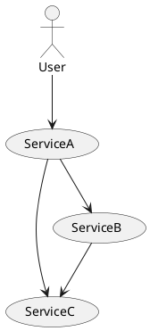
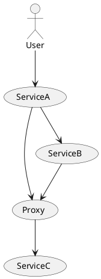

# Примеры использования Resolve + Dtab в Finagle

## Simple
Простой пример использования Resolver. 
В качестве результата получаем не IP+Port, а ServiceFactory,
то есть фактически запрос по сети не выполняется, а остается внутри. 

## Async
Пример, как можно менять набор доступных адресов. 
В частности, каждый N секунд, создаем новый ServiceFactory, 
который логирует время своего создания и время запроса к нему. 

## File
Уже более полезный пример, как можно использовать некоторый файл,
чтобы хранить в нем список хостов и метаданные к ним. 
Данный Resolver позволяет реагировать на обновление файла (проверяет каждые 5 секунд). 

## Dtab
Пример демонстрирует работу с distribution table.

## Routing
Пример использования Dtab.local для подмены маршрутов на низлежаших сервисах.

Так же показано, как поднятый сервер может сообщить о том на каком порту он поднялся.

Маршрут запросов без подмены: 

С подменой:

